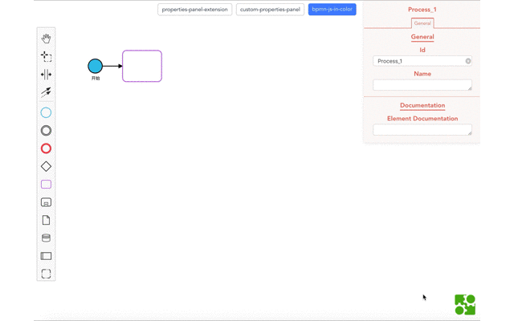
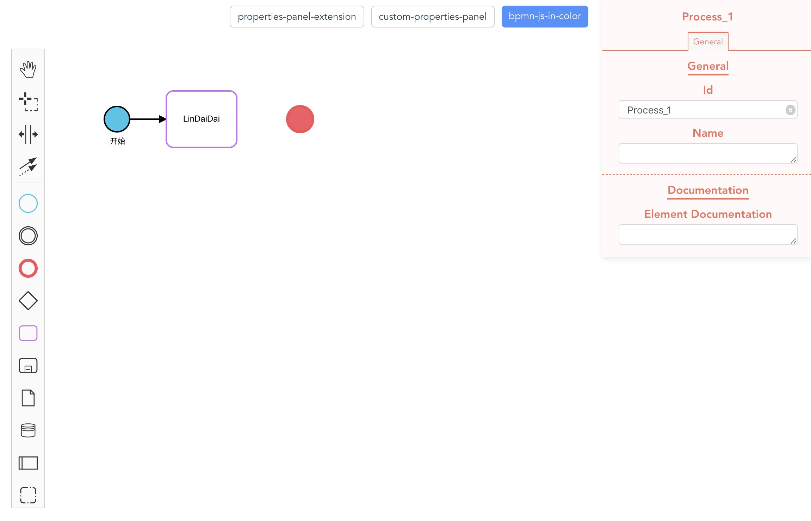
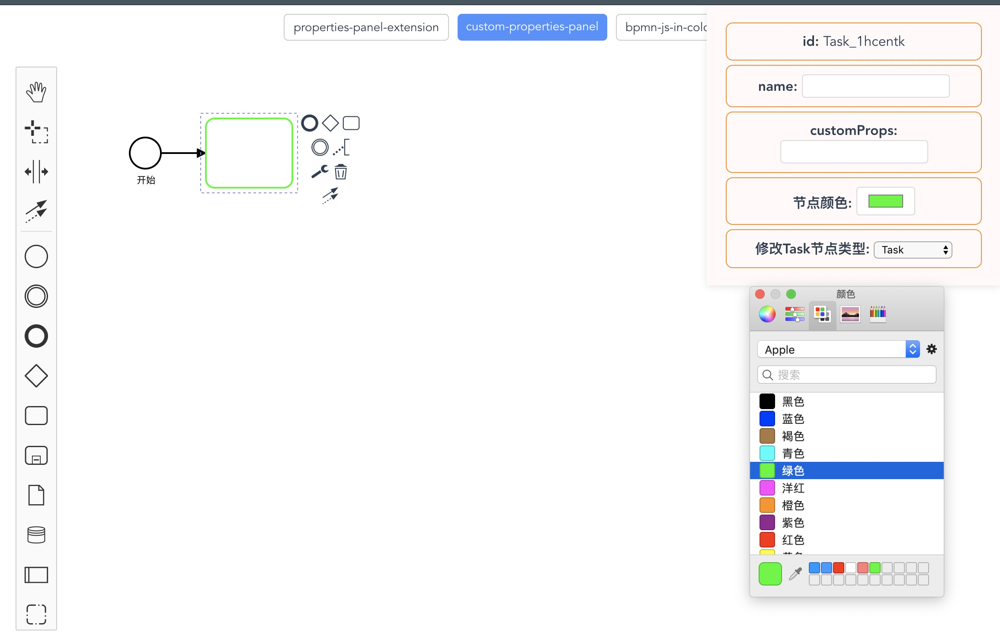
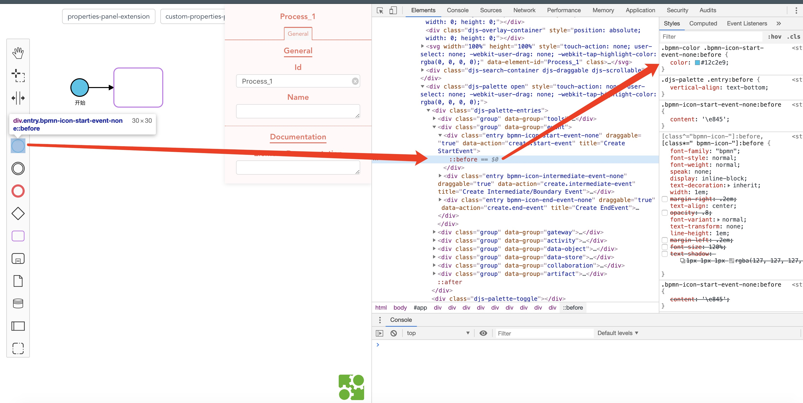
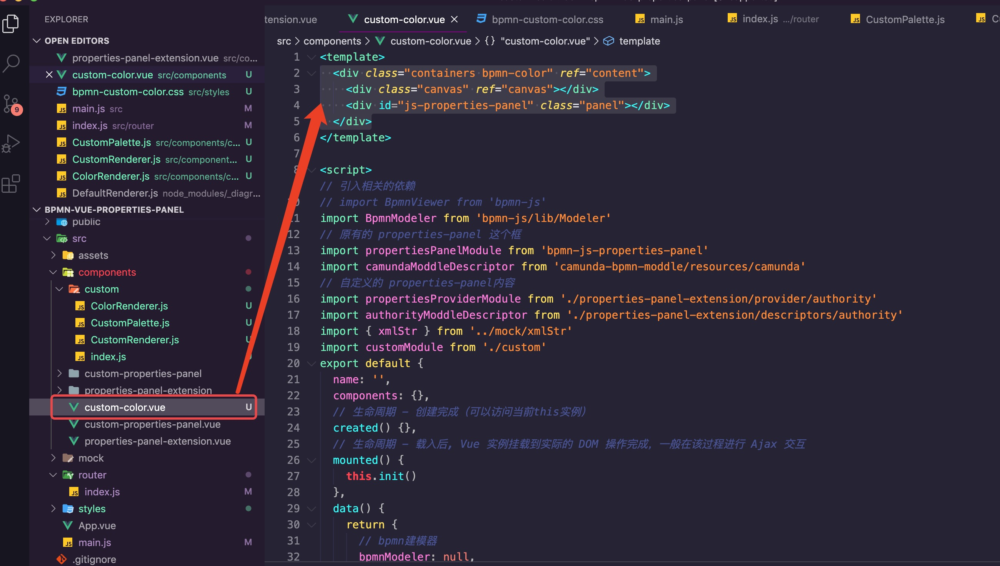
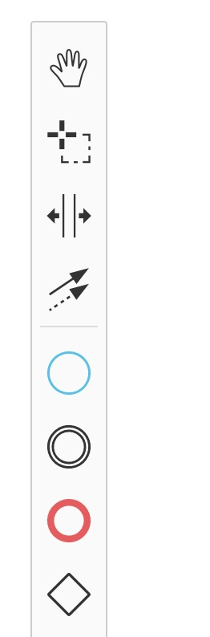

## 前言

> Q: bpmn.js是什么? 🤔️

[bpmn.js](https://bpmn.io/)是一个BPMN2.0渲染工具包和web建模器, 使得画流程图的功能在前端来完成.

> Q: 我为什么要写该系列的教材? 🤔️

因为公司业务的需要因而要在项目中使用到`bpmn.js`,但是由于`bpmn.js`的开发者是国外友人, 因此国内对这方面的教材很少, 也没有详细的文档. 所以很多使用方式很多坑都得自己去找.在将其琢磨完之后, 决定写一系列关于它的教材来帮助更多`bpmn.js`的使用者或者是期于找到一种好的绘制流程图的开发者. 同时也是自己对其的一种巩固.

首先先说明一点吧，`bpmn.js`主要是为画工作流做规则引擎用的，所以如果您的工作中并不涉及到这一块的话可以不用浪费时间阅读本篇文章。当然如果您为此感兴趣的话可以移步[bpmn-chinese-document](https://github.com/LinDaiDai/bpmn-chinese-document)看看它的介绍，如果你对它不感兴趣对我感兴趣的话可以移步我的个人博客[niubility-coding-js](https://github.com/LinDaiDai/niubility-coding-js) (好惨没一个Star)😄。

由于是系列的文章, 所以更新的可能会比较频繁, **您要是无意间刷到了且不是您所需要的还请谅解**😊.

求赞👍求心❤️. 更希望能对你有一点小小的帮助.

完整目录及`GitHub`地址：[bpmn-chinese-document](https://github.com/LinDaiDai/bpmn-chinese-document)

## Color篇

很久没写`bpmn.js`系列的教材了...😄，写起来还是感觉挺亲切的。

这篇文章主要是介绍一下在`bpmn.js`中修改节点颜色的各种场景和方式，算是[bpmn.js交流群](https://juejin.im/post/5e15b149e51d45238744d3d0)群里的一个热门问点吧。另外文章中我会以几个常用类型的节点作为案例来进行讲解，比如`StartEvent、Task、EndEvent`这几种类型，其它类型的修改和案例中的大同小异，还请自行扩展。

因为我一直相信`授人予鱼不如授人予渔`，这才是一篇教程真正能带给你的东西。我们在实际开发中肯定会遇到各种各样不同的需求，不可能每篇教程都能刚好符合你的业务要求，所以我能做的只是保证你能有一定的`bpmn.js`使用基础并在此基础上有自己的思考。

好了话不多说咯，来看看，通过阅读你可以学习到：

- 修改`palette`左侧工具栏中的节点颜色
- 修改`renderer`渲染在页面上的节点颜色
- 修改`contextPad`上的节点颜色
- 在渲染完成之后用户手动触发修改节点颜色

来几张张效果图看看：



(这狗血的画质...)





因为内容不多，所以就没有另起一个案例项目。

以下所有案例都整理在[bpmn-properties-panel](https://github.com/LinDaiDai/bpmn-vue-properties-panel)里面。`Color`篇的展示主要是在`custom-color`这个页面下，代码是放在`components/custom-color.vue`中。


## 修改`palette`左侧工具栏中的节点颜色

左侧工具栏修改节点颜色很简单，只需要找到对应节点的类名在`css`中修改就可以了。

例如我修改了案例中的开始节点。

1. 找到开始节点的类名



2. 在一个全局样式中修改它

如果你和我一样不想要所有的`palette`都被修改颜色，可以指定某一个页面下进行修改，方式是给你生成`bpmn`图的容器添加一个类名：

`custom-color.vue`

```vue
<div class="containers bpmn-color" ref="content">
  <div class="canvas" ref="canvas"></div>
</div>
```

例如我这里只修改`custom-color`页面中的`palette`



给它加上`bpmn-color`这个类名。

然后在全局的`/styles/bpmn-custom-color.css`中修改类的样式：

```css
.bpmn-color .bpmn-icon-start-event-none:before {
  color: #12c2e9;
}
.bpmn-color .bpmn-icon-task:before {
  color: #c471ed;
}
.bpmn-color .bpmn-icon-end-event-none:before {
  color: #f64f59;
}
```


3. 将自定义的样式引入到`main.js`中

最后一步就是要把我们自定义的样式引入到`main.js`里，这里有一个要注意的就是自定义的样式要放在`bpmn.js`自带的样式下面：

`main.js`

```javascript
import Vue from 'vue'

import 'bpmn-js/dist/assets/diagram-js.css' // 左边工具栏以及编辑节点的样式
import './styles/bpmn-custom-color.css' // 自定义样式
```

现在保存打开页面就可以看到效果了。



不过这个只能修改图像边框的颜色，因为这个图像本质就是一个`icon`字体，所以可以用`color`这个属性来控制字体的颜色。而字体颜色的范围是由这个`icon`图像本身决定的，也就是说如果这个字体它本身就是个圆环，那`color`也就只能修改它的圆边框；如果这个字体本身就是个完整的圆，那`color`肯定也就能修改整个圆了。


## 修改`renderer`渲染在页面上的节点颜色

光有左侧工具栏的修改还不够，最主要的是要渲染的时候能修改为自己想要的颜色。

例如你的需求可能是在进行初始化的时候，就需要根据节点的类型来将节点修改为不同的颜色。

比如`StartEvent`修改为红色，`Task`修改为蓝色等等。

这时候我们需要用到之前在[自定义renderer篇]()中提到过的「在默认的Renderer基础上修改」。对`renderer`不懂的小伙伴一定要先阅读自定义renderer篇才行。

在此我假设你已经完全了解了`renderer`。

那么我们知道一个元素能否成功在页面上渲染，关键的代码就是在`CustomRenderer`中重写`drawShape`这个方法。

而这个方法其实依赖的是这段代码：

```javascript
//CustomRenderer.js

drawShape(parentNode, element) {
    let shape = this.bpmnRenderer.drawShape(parentNode, element)
    return shape
}
```

也就是说是靠`this.bpmnRenderer.drawShape`这个方法将`element`对象转换为一个`svg`形式的节点。

最开始我的想法是在转换之前使用`modeling.setColor`方法来修改`element`的相应样式：

```javascript
//CustomRenderer.js

drawShape(parentNode, element) {
		modeling.setColor(element, {
    	fill: null,
    	stroke: color
    })
    let shape = this.bpmnRenderer.drawShape(parentNode, element)
    return shape
}
```

但这种方式失败了，打开控制台报了一堆的红色错误，大致就是进入了死循环，浏览器爆栈了。

想了一下其实也好理解，`renderer`的作用本就是将`element`进行渲染，但是在这个阶段你又用`setColor`去修改`element`的这个属性，那这样肯定就会造成递归循环渲染，所以这种做法被我否定了。

之后我想了一下，使用`drawShape`方法产生的东西会是什么呢？带着好奇我把生成的`shape`打印出来看了一下，发现他就是一个`DOM`元素：

```javascript
// StartEvent
<circle cx="18" cy="18" r="18" style="stroke: black; stroke-width: 2px; fill: rgb(18, 194, 233); fill-opacity: 0.95;"></circle>

// TaskEvent
<rect x="0" y="0" width="100" height="80" rx="10" ry="10" style="stroke: rgb(196, 113, 237); stroke-width: 2px; fill: white; fill-opacity: 0.95;"></rect>
```

既然是`DOM`元素那可就简单了，只需要用修改`DOM`元素样式的方法来处理就可以了。

所以其实你可以这样做：

```javascript
//CustomRenderer.js

drawShape(parentNode, element) {
    let shape = this.bpmnRenderer.drawShape(parentNode, element)
    shape.style.setProperty('fill', 'red')
    return shape
}
```

在生成`shape`之后使用`style.setProperty`方法修改想要修改的属性就可以了。

在一个`shape`中，主要是有这么几种属性可以供我们修改：

- `fill`：元素的填充色
- `stroke`：元素的边框颜色
- `strokenWidth`：元素边框的宽度

为了方便管理和配置我在`CustomRenderer.js`中定义了一个配置项，另外封装了一个`setShapeProperties`方法专门用来处理节点颜色的问题，核心代码就这么些：

```javascript
const propertiesConfig = {
  'bpmn:StartEvent': {
    fill: '#12c2e9'
  },
  'bpmn:Task': {
    stroke: '#c471ed',
    strokeWidth: 2,
  },
  'bpmn:EndEvent': {
    stroke: '#f64f59',
    fill: '#f64f59'
  }
}

export default class CustomRenderer extends BaseRenderer {
  drawShape(parentNode, element) {
      let shape = this.bpmnRenderer.drawShape(parentNode, element)
      setShapeProperties(shape, element)
      return shape
  }
}

function setShapeProperties (shape, element) {
  const type = element.type // 获取到的类型
  if (propertiesConfig[type]) {
    const properties = propertiesConfig[type]
    Object.keys(properties).forEach(prop => {
      shape.style.setProperty(prop, properties[prop])
    })
  }
}
```

通过`PropertiesConfig[type]`判断有没有要自定义的元素，有的话就走`if`判断里。

`Object.keys()` 方法其实就是获取某个对象下的所有属性名称，比如：

```javascript
var obj = { a: 1, b: 2 }
console.log(Object.keys(obj)) // ['a', 'b']
```

这个写前端的可能都知道，主要是怕后台人员不了解所以提一嘴。


现在保存刷新页面后就可以看到效果了 😊：


## 修改`contextPad`上的节点颜色

`contextPad`上的节点颜色，事实上和修改`palette`是一样的。因为它们共用了一个`className`。因此如果你改了`palette`上的样式，`contextPad`上的也会被修改。


## 在渲染完成之后用户手动触发修改节点颜色

这个功能的主要作用是说，在渲染成功之后，可能需要用户手动去修改某个节点的颜色。

额...这其实在[全网最详bpmn.js教材-poperties-panel篇(下)](./全网最详bpmn.js教材-poperties-panel篇(下).md)中也说到过了吧，核心方法就是用使用`modeling.setColor()`方法去修改。

```javascript
const modeling = this.modeler.get('modeling')
modeling.setColor(element, {
  fill: 'blue',
  stroke: 'red'
})
```

在此不再重复说了 😁。


另外我在官网也发现了有关于`colors`的案例，它主要是能配合`xml`标签上的属性来进行相应颜色的修改，有兴趣的小伙伴可以看一下：

[bpmn-js colors](https://github.com/bpmn-io/bpmn-js-examples/tree/master/colors)

[bpmn-js-task-priorities](https://github.com/bpmn-io/bpmn-js-task-priorities)


## 后语

从`2019年12月10日`最开始写此教材到现在已经四个月了，`bpmn.js交流群`也从最开始的`3,4`个人扩展到了现在的`200`人，还是挺欣慰的。

也很感谢群里的一些小伙伴能热心的为新来的小伙伴解答问题提供帮助，我在此代接受过帮助的小伙伴谢谢大家！

不过也希望能有更多的小伙伴能积极的参与到[bpmn-chinese-document](https://github.com/LinDaiDai/bpmn-chinese-document)的项目中来，也算是为国内`bpmn.js`的社区贡献一份力吧💪。

最后还请能给[bpmn-chinese-document](https://github.com/LinDaiDai/bpmn-chinese-document)一个`Star`🌟，编写整理都不易，感谢🙏。

